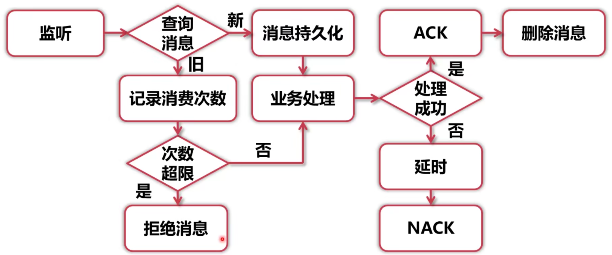

# 可靠消息投递、可靠消息消费的分布式事务框架

## 业务流程

用户下单、等待支付、支付后餐厅确认、系统分配骑手、订单送达、订单结算、积分奖励

## 工具及版本

- SpringBoot ```2.3.12.RELEASE```
- SpringCloud ```Hoxton.SR12```
- SpringCloudAlibaba ```2.2.10-RC1```
- MybatisPlus ```3.5.2```
- RabbitMQ ```3.12.2```
- MySql ```8.0.32```
- Nacos ```2.2.0```
- Seata ```1.6.1```

## 分布式事务解决方案

- Seata+Nacos
- RabbitMQ + 延时队列 + 死信队列 + 消息确认
- 本地消息表(记录事务执行的某一方法) + RocketMQ/RabbitMQ

### 传统事务 ACID

1. 原子性
2. 一致性
3. 隔离性
4. 持久性

分布式事务无法满足原子性和隔离性

### 分布式事务

CAP无法同时满足

- 一致性
- 可用性
- 分区容忍性

BASE理论

- BA 基本可用
- Soft State 软状态
- Eventually consistent 最终一致性

系统框架

- 发送失败重试
- 消费失败重试
- 死信告警

## RabbitMQ + 延时队列 + 死信队列 + 消息确认
### 消息可靠性处理

- Producer

1. 使用RabbitMQ发送端确认机制，确认消息成功发送到MQ并被处理。
    - 单条同步确认
    - 多条同步确认
    - 异步确认
2. 使用RabbitMQ消息返回机制，若没发现目标队列，MQ会通知发送方

- Consumer

1. 使用RabbitMQ消费端确认机制，确认消息没有发送处理异常
    - 单条手动Ack
    - 多条手动Ack
    - NAck重回队列
2. 使用RabbitMQ消费端限流机制，不同机器处理能力有差异，限制消息推送速度，保障接收端服务稳定
    - 使用QoS功能保证在一定数目的消息未被确认前，不消费新的消息，前提是不使用AutoAck
    - QoS最大的作用是方便做横向扩展，在一个服务消费不过来时，另一个服务也可以去队列中取走消息去消费。如果不开启，所有消息都被一个服务抢占而不处于Ready状态，其他服务只能等待而不能消费。
    - QoS也可以减轻服务的压力

- MessageQueue

1. 大量消息堆积会给MQ产生巨大压力，需要使用RabbitMQ设置消息过期时间，防止消息大量积压
    - 解决队列爆满
    - 消息TTL：单条消息的过期时间
    - 队列TTL：队列中所有消息的过期时间
    - TTL应该明显长于服务的平均重启时间，防止在服务重启的时候消息超时
    - TTL应长于业务高峰期时间
2. 使用RabbitMQ死信队列，收集过期消息以供分析
    - 怎样变成死信：
   
      1.消息被reject/nack，且requeue=false 
   
      2.消息TTL到期或者队列TTL到期
   
      3.队列达到最大长度后，后面到达的消息被丢弃
    - 消息过期后会被直接丢弃，无法对系统运行异常发出警告
    - 死信队列：队列配置了DLX属性（Dead-Letter-Exchange）
    - 当一个消息变成死信后，能重新被发布到另一个交换机上，经过路由后会进入一个固定的队列

### 实现流程
1. 确保生产者投递消息成功，使用消息确认机制confirm，如果消息投递失败，人工进行补偿
2. 确保消费者消费成功，采用手动ack的形式。如果消费失败，mq自动帮我们补偿，如果达到补偿上线，进行日志记录或者放入死信队列，后期进行人工补偿
3. 当订单生产者投递成功以后，后续代码出错，导致事务回滚，需要采用补单队列，即订单生产者在投递消息的时候，不光要投递派单消息，还需要把订单消息一并带过去，补单消费者接收到消息以后，先去数据库查询数据是否存在，如果不存在的话，补单消费者进行补单

### 消息发送失败重试

- 发送消息前消息持久化
- 发送成功时删除消息
- 定时检查未发送成功的消息，尝试重发
  

### 消费失败重试

- 收到消息时先持久化
- 消息处理成功，消费端手动Ack，删除消息
- 消息处理失败时，延时一段时间，不确认消息，记录重试次数，重回队列
- 再次处理消息
  

### 死信消息处理

- 声明死信队列、交换机、绑定
- 普通队列加入死信设置
- 监听到死信后，持久化处理，并设置告警
  

### RabbitMQ延时队列

#### 消息存活时间

1. RabbitMQ可以对队列和消息分别设置TTL。 
2. 对队列设置就是队列没有消费者连着的保留时间，也可以对每一个单独的消息做单独的设置。超过了这个时间，消息成为死信。 
3. 如果队列和消息都设置了，那么会取小的。所以一个消息如果被路由到不同的队列中，这个消息的死亡时间有可能不一样（不同的队列设置）。 
4. 单个消息的TTL，才是实现延迟任务的关键。可以通过设置消息的expiration字段或者x-message-ttl属性来设置时间，两者是一样的效果。

#### 死信交换机

1. 一个消息如果满足如下条件，就会进入死信路由（不是队列，一个路由可以对应多个队列）

   - 一个消息被消费者拒收，并且reject方法的参数里requeue是false。也就是说不会被再次放在队列里，被其他消费者使用。
   - 消息的TTL到了，消息过期了。
   - 队列长度限制满了，排在前面的消息会被丢弃或者扔到死信路由上。

2. 在某一个设置Dead Letter Exchange的队列中有消息过期了，会自动触发消息的转发，发送到Dead Letter Exchange中去
3. 先控制消息在一段时间后变成死信，然后控制变成死信的消息被路由到某个指定的交换机。二者结合就可以实现一个延时队列。

## 本地消息表 + RocketMQ / RabbitMQ

### 实现流程

对第三方的操作，最后是执行一个方法，将方法的执行存储成数据库的一条记录，若一个方法被事务执行，则在事务执行之前该方法会被保存，在事务提交后该方法会从数据库中拿出来被再次执行。
如果执行失败，在数据库中会进行记录，并又定时器轮询将执行失败的方法继续执行，直到执行成功或超过最大重试次数。如果执行成功，该执行记录将会在数据库中被删除。

### @SecureInvoke 保证方法可靠执行注解
1. 如果该方法不在事务中则直接执行
2. Aop切面将请求执行的方法参数保存
3. 记录随上层事务一起入库，如果事务执行失败则回滚
4. 事务执行后进行回调，根据是否异步将方法重新执行
5. 重试时间采用指数上升或退避算法

## Seata
[官方文档](https://seata.io/en-us/docs/overview/what-is-seata.html)

[Github](https://github.com/seata/seata)

[社区](https://seata.io/en-us/community/index.html)

是一种开源分布式事务解决方案，可在微服务架构下提供高性能且易于使用的分布式事务服务。

### Seata Framework 中有三个角色：

**事务协调器（TC）**：维护全局和分支事务的状态，驱动全局提交或回滚。

**Transaction Manager(TM)**：定义全局事务的范围：开始全局事务、提交或回滚全局事务。

**资源管理器（RM**）：管理分支事务处理的资源，与TC通信以注册分支事务并报告分支事务的状态，并驱动分支事务的提交或回滚。

### Seata 管理的分布式事务的典型生命周期：

- TM 要求 TC 开始新的全局事务。TC 生成代表全局事务的 XID。
- XID 通过微服务的调用链传播。
- RM将本地事务作为XID对应的全局事务的分支注册到TC。
- TM请求TC提交或回滚XID对应的全局事务。
- TC驱动XID对应的全局事务下的所有分支事务来完成分支提交或回滚。

## 两阶段提交
全局事务是由若干分支事务组成的，分支事务要满足**两阶段提交**的模型要求，即需要每个分支事务都具备自己的：

- 一阶段 prepare 行为
- 二阶段 commit 或 rollback 行为
  根据两阶段行为模式的不同，我们将分支事务划分为 **Automatic (Branch) Transaction Mode** 和 **TCC (Branch) Transaction Mode.**

### AT模式 基于支持本地 ACID 事务的关系型数据库

默认模式，简单，需要增加undo_log表，不需要写补偿的动作。生成反向SQL，性能比较高。

回滚后，不能置失败状态，原来没数据的事务后仍没数据，既负责调度，也负责补偿。

- 一阶段 prepare 行为：在本地事务中，一并提交业务数据更新和相应回滚日志记录。
- 二阶段 commit 行为：马上成功结束，**自动** 异步批量清理回滚日志。
- 二阶段 rollback 行为：通过回滚日志，**自动** 生成补偿操作，完成数据回滚。

### TCC模式（Try Confirm / Cancel）
不依赖于底层数据资源的事务支持。三阶段的代码需要自己实现，如果子事务全部成功，则执行Confirm逻辑，若子事务有一个失败，则执行Cancel逻辑。Seata只负责调度。

注解式实现，指明try成功和失败时分别调用什么方法

缺点：对业务代码侵入性较强，必要时可能修改数据库

- 一阶段 prepare 行为：调用 **自定义** 的 prepare 逻辑。
- 二阶段 commit 行为：调用 **自定义** 的 commit 逻辑。
- 二阶段 rollback 行为：调用 **自定义** 的 rollback 逻辑。

所谓 TCC 模式，是指支持把 **自定义** 的分支事务纳入到全局事务的管理中。

### SAGA模式
长事务解决方案，需要编写两阶段代码。

基于状态机实现，需要一个JSON文件，可异步执行，整个程序的执行由JSON和状态及受Seata控制。

### XA模式
XA协议是由X/OPEN组织提出的分布式事务的处理规范，基于数据库的XA协议来实现2PC又称XA方案。

需要数据库本身支持XA协议，可以跨数据库，适用于强一致性的场景，如金融、银行。

## 部署运行

1. 将微服务引入，各个模块引入rabbit-dts

```
<dependency>
    <groupId>com.sdu</groupId>
    <artifactId>rabbit-dts</artifactId>
    <version>1.0</version>
</dependency>
```

2. 启动rabbitMQ
``` shell
cd RabbitMQ/sbin
./rabbitmq-server -detached 
./rabbitmqctl start_app     // 或
```

3. 测试数据准备

- 预先在deliveryman表中插入一条数据
```mysql
INSERT INTO `deliveryman` VALUES (1, '配送员1号', 'AVAILABLE', '2020-06-10 20:30:17');
```
- 在product表中插入一条数据
```mysql
INSERT INTO `product` VALUES (2, '北京烤鸭', 18.38, 1, 100, 0, 'AVAILABLE', '2020-05-06 19:19:04');
INSERT INTO `product` VALUES (3, '鱼香肉丝', 25.25, 1, 100, 0, 'AVAILABLE', '2020-05-06 19:19:05');
```
- 在restaurant表中插入一条数据
```mysql
INSERT INTO `restaurant` VALUES (1, '古丽花儿', '长江路1号', 'OPEN', 1, '2020-05-06 19:19:39');
```

4. 通过127.0.0.1:8865/api/order/create POST 接口进行测试 RequestBody:
``` json
{
    "accountId": 43295,
    "address": "成华大道",
    "productId": 2
}
```
